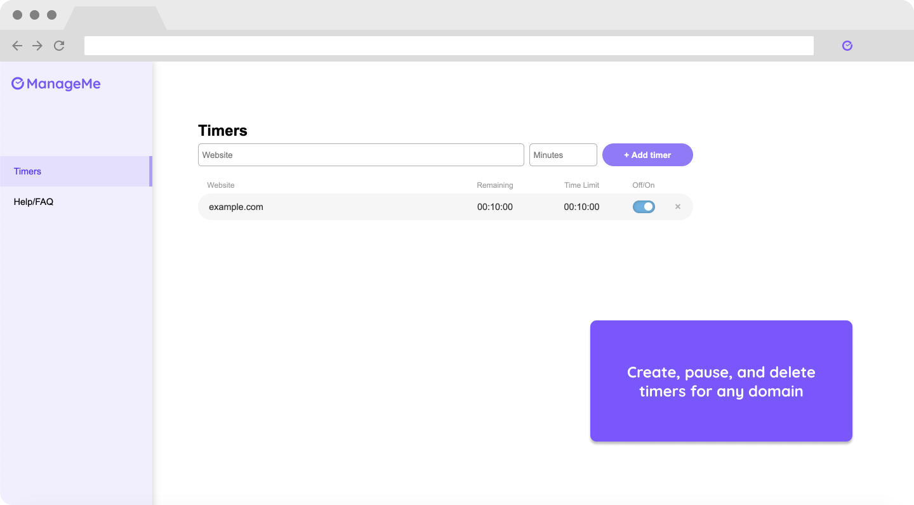
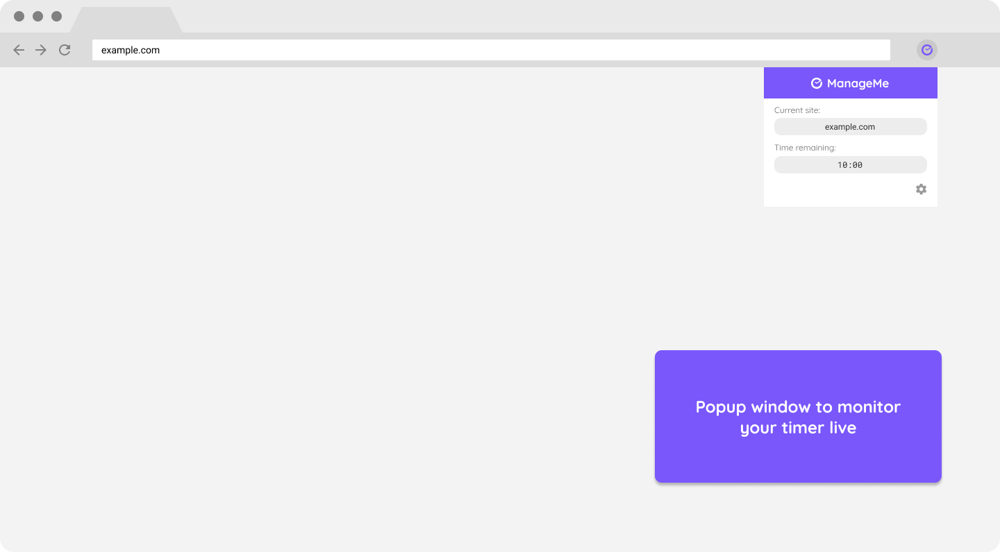

# ManageMe

ManageMe is a Google Chrome extension that time-manages the daily amount of time
spent on websites.

Built using jQuery, Javascript, HTML/CSS, and Figma

## Motivation
ManageMe was made with the intention to help users manage their time with a 
reliable yet flexible solution. Users can create timers for different domains, 
toggle their timers, and completely block them.

## Screenshots
Options page:

Popup window:

## Libraries Used
* [jQuery 3.5.1](https://jquery.com)
* [psl 1.8.0](https://www.npmjs.com/package/psl)

## Other Credits
* [Blocked page splash screen photo by Dirk Scheuble on Unsplash](https://unsplash.com/photos/MpN-RvJ4lRc)
* [Settings icon by Google on Flaticon](https://www.flaticon.com)
